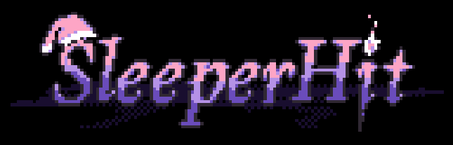

<h1 align="center"> Sleeperhit </h1>

    

 Repositorio para el juego <b>Sleeperhit</b>, desarrollado para la asignatura de <b>Software de Entretenimiento y Videojuegos</b> en la Universidad de Oviedo. 

<h2 align="center"> Cómo ejecutar </h2>

 Para ver el código y ejecutar el juego, <a href="https://visualstudio.microsoft.com/es/downloads/"> instala Visual Studio </a> y abre el archivo <b>"Sleeperhit.sln"</b>. Una vez se haya abierto, en la parte superior del editor, selecciona la opción de <b>x86</b> y ejecuta el depurador.
